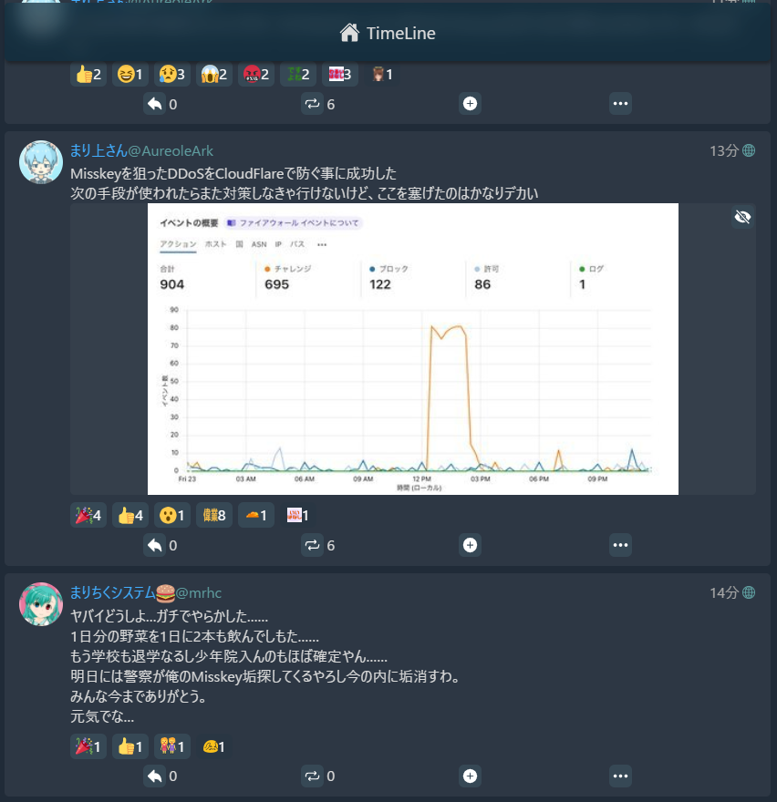
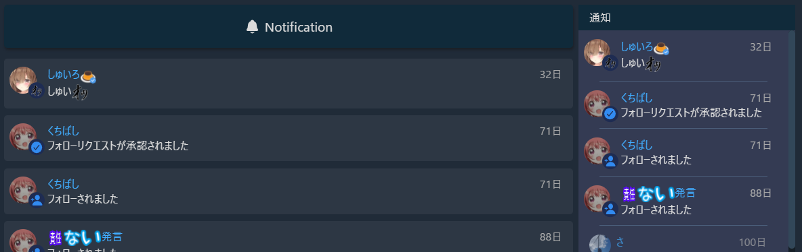
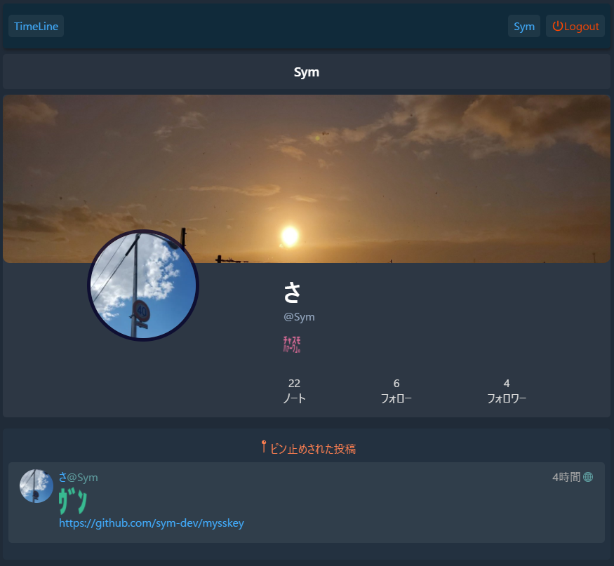
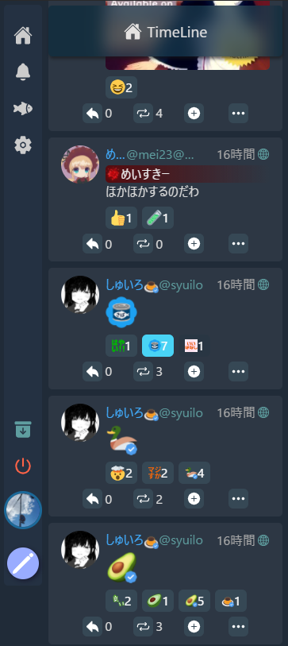
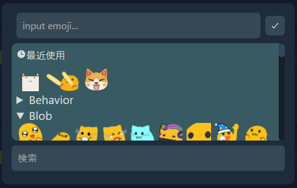

## ⚠️ 現在は後継クライアントの[at Dusk.](https://github.com/sym-dev/at-Dusk)を開発しています。mysskeyはメンテナンスされていません。

# Mysskey - simple Misskey client

Mysskey(まいすきー)は分散型SNS[Misskey](https://github.com/misskey-dev/misskey)のWebクライアントです。Misskey v12.28.0以上のインスタンスで利用可能です。

[mysskey.pages.dev](https://mysskey.pages.dev)から利用できます。

  
Features

  

    
Available

    <ul>
      <li> タイムライン(ホーム、ローカル、ソーシャル、グローバル)の閲覧</li>
      <li>  画像のNSFW(Not Safe For Work, 閲覧注意)の対応</li>
      <li>投稿詳細の閲覧(リプツリー、被引用など)</li>
      <li>ユーザーページの閲覧</li>
      <ul><li>ユーザーのフォロー</li></ul>
      <ul><li>ピン止め投稿の表示</li></ul>
      <ul><li>ユーザーの投稿(投稿、返信を含む投稿)表示</li></ul>
      <ul><li>フォロー、フォロワー一覧</li></ul>
      <li>通知の閲覧</li>
      <li>フォローリクエストの確認、承認・拒否</li>
      <li>投稿</li>
      <ul><li>公開範囲(グローバル、ホーム、フォロワー限定)</li></ul>
      <ul><li>CW(Content Warning)</li></ul>
      <ul><li>絵文字ピッカー</li></ul>
      <li>返信</li>
      <li>Renote、引用</li>
      <li>リアクション</li>
      <li><ul><li>リアクションピッカー</li></ul></li>
      <li>ピッカーの最近使った絵文字機能</li>
      <li>TLで自動でもっと見る機能</li>
      <li>TLのクリア機能</li>
    </ul>
  

  

    
Unavailable

    <ul>
      <li>あなた宛て、DM、チャンネル、アンテナ、リストなどのTLの閲覧</li>
      <ul><li>投稿時のDM公開範囲設定</li></ul>
      <li>チャット</li>
      <li>ドライブ</li>
      <ul><li>投稿時のメディア添付</li></ul>
      <li>ギャラリー</li>
      <li>ハイライト</li>
      <li>見つける</li>
      <li>お知らせ</li>
      <li>検索</li>
      <li>グループ</li>
      <li>お気に入り</li>
      <li>ページ</li>
      <li>クリップ</li>
      <li>Misskey Games</li>
      <li>スクラッチパッド</li>
      <li>ルーム</li>
      <li>多くの設定</li>
      <li>etc..</li>
    </ul>
  

### ScreenShots

#### タイムライン

#### 通知ページ & 通知バー

#### ユーザーページ

#### モバイルUI

#### 絵文字ピッカー

